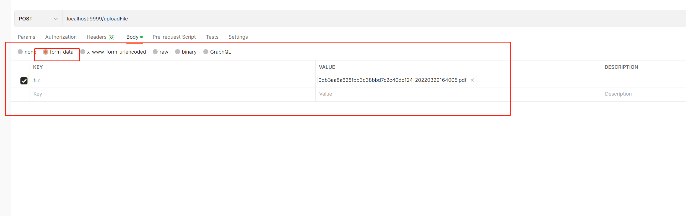

<h1 style="font-weight:normal">
  <a href="http://resume.needkk.com">
    
  </a>
  &nbsp;resume-elasticsearch&nbsp;
  <a href="http://resume.needkk.com"></a>
  <a href="https://github.com/NeeDKK/es-document-search" target="_blank"></a>

</h1>

个人简历通过接口上传到es中，es通过pipline解析pdf简历中的内容，并存储。

提供检索api，根据关键字检索简历中的内容
<br/>

demo: http://resume.needkk.com
<br>

> - node版本 > v14
> - golang版本 >= v1.17
> - elasticsearch > v7.7

## es检索文件内容

### 一、es及kibana的安装

#### 1.1安装es

> 1.1.1.创建文件夹
>
> ```shell
> mkdir /root/es/data #数据目录
> mkdir /root/es/plugins #插件目录
> chmod 777 /root/es/data
> chmod 777 /root/es/plugins
> ```
>
> 1.1.2.编写容器编排文件
>
> ```shell
> cd /root/es
> vim docker-compose.yaml
> ```
>
> ```yaml
> version: '3'
> services:
>   elasticsearch:
>     image: elasticsearch:7.7.0  #镜像
>     container_name: elasticsearch  #定义容器名称
>     restart: always  #开机启动，失败也会一直重启
>     environment:
>       - "cluster.name=elasticsearch" #设置集群名称为elasticsearch
>       - "discovery.type=single-node" #以单一节点模式启动
>       - "ES_JAVA_OPTS=-Xms512m -Xmx1024m" #设置使用jvm内存大小
>     volumes:
>       - ./plugins:/usr/share/elasticsearch/plugins #插件文件挂载
>       - ./data:/usr/share/elasticsearch/data #数据文件挂载
>     ports:
>       - 9200:9200
> ```
>
> 1.1.3.启动容器
>
> ```shell
> docker-compose up -d
> ```

#### 1.2安装kibana

> 1.2.1.创建文件夹
>
> ```shell
> mkdir /root/kibana
> ```
>
> 1.2.2.编写容器编排文件
>
> ```shell
> cd /root/kibana
> vim docker-compose.yaml
> ```
>
> ```yaml
> version: '3'
> services:  
>  kibana:
>   image: kibana:7.7.0 # 与 es 版本对应
>   restart: always
>   container_name: kibana
>   volumes:
>    - /root/kibana/kibana.yml:/usr/share/kibana/config/kibana.yml
>   ports:
>     - '5601:5601'     #暴露端口
>   privileged: true    #特权启动
> ```
>
> 1.2.3.kibana配置文件
>
> ```shell
> vim kibana.yml
> ```
>
> ```yaml
> server.name: kibana
> # kibana的主机地址 0.0.0.0可表示监听所有IP
> server.host: "0.0.0.0"
> # kibana访问es的URL
> elasticsearch.hosts: [ "http://ip:9200" ]
> elasticsearch.username: 'kibana'
> elasticsearch.password: '123456'
> # 显示登陆页面
> xpack.monitoring.ui.container.elasticsearch.enabled: true
> # kibana窗口最大可发送请求大小
> server.maxPayloadBytes: 10485760
> # # 语言
> # #i18n.locale: "zh-CN"
> ```
>
> 1.2.4.启动容器
>
> ```yaml
> docker-compose up -d
> ```
>
>

### 二、es安装ik分词器和ingest-attachment文本抽取插件

> 2.1.1.进入容器
>
> ```shell
> docker exec -it elasticsearch /bin/bash
> ```
>
> 2.1.2.安装插件
>
> ```shell
> cd /usr/share/elasticsearch/bin
> #安装ik分词器（版本与es版本保持一致）
>  ./elasticsearch-plugin install https://github.com/medcl/elasticsearch-analysis-ik/releases/download/v7.7.0/elasticsearch-analysis-ik-7.7.0.zip
> #安装文本抽取器
> ./elasticsearch-plugin install ingest-attachment
> 
> ```
>
> 2.1.3.重启es容器
>
> ```shell
> docker restart elasticsearch
> ```

### 三、创建关键索引和文档解析pipline

#### 3.1创建索引

```json
PUT /resumeanalysis
{
  "mappings": {
    "properties": {
      "id": {
        "type": "keyword"
      },
      "name": {
        "type": "text",
        "analyzer": "ik_smart",
        "search_analyzer": "ik_smart"
      },
      "school": {
        "type": "text",
        "analyzer": "ik_smart"
      },
      "attachment": {
        "properties": {
          "content": {
            "type": "text",
            "analyzer": "ik_smart",
            "search_analyzer": "ik_smart"
          }
        }
      }
    }
  }
}
```

#### 3.2创建pipline

```json
PUT /_ingest/pipeline/resumecontent
{
  "description": "analysis resume content",
  "processors": [
    {
      "attachment": {
        "field": "content",
        "ignore_missing": true
      }
    },
    {
      "remove": {
        "field": "content"
      }
    }
  ]
}
```

### 四、golang代码

#### 4.1创建gin服务

#### 4.2初始化es连接

#### 4.3创建上传和查询接口

### 五、请求实例

#### 5.1上传接口请求参数

#### 5.1.1上传json内容的参数

```json
localhost:9999/upload

{
"id": 1,
"name": "张三",
"school": "北京大学",
"content": "MS7nsr7pgJpqYXZhLOmdnuW4uOaJjuWunueahGphdmHnvJbnqIvlip/lupUs5ZKM6Imv5aW955qE57yW56CB5Lmg5oOvOyAKMi7nsr7pgJpqc3Avc2VydmxldC9qZGJjL3N0cnV0cyxzdHJ1dHMyLjEsaGliZXJuYXRlYW5ub2NhdGlvbuWSjOaKgOacrzsKMy7nhp/nu4Pkvb/nlKhteWVjbGlwc2UsZWNsaXBzZSxkcmVhbXdlYXZlcuW8gOWPkeW3peWFtzsgCjQu5bqU55So5pyN5Yqh5Zmod2VibG9naWPjgIF0b21jYXQ="
}
```

响应：

```json
{
  "code": 0,
  "data": {
    "_index": "resumeanalysis",
    "_type": "_doc",
    "_id": "NcDdFIUBuZQ-A4PtPA_t",
    "_version": 1,
    "result": "created",
    "_shards": {
      "total": 2,
      "successful": 1,
      "failed": 0
    },
    "_primary_term": 1
  },
  "msg": "上传成功"
}
```

#### 5.1.2上传简历文件

```json
localhost:9999/uploadFile
```



响应：

```json
{
  "code": 0,
  "data": {
    "_index": "resumeanalysis",
    "_type": "_doc",
    "_id": "esB6FYUBuZQ-A4PtqR-a",
    "_version": 1,
    "result": "created",
    "_shards": {
      "total": 2,
      "successful": 1,
      "failed": 0
    },
    "_seq_no": 4,
    "_primary_term": 1
  },
  "msg": "上传成功"
}
```

#### 5.2查询接口请求参数

```json
localhost:9999/search?searchContent=熟悉&size=2&page=1
```


